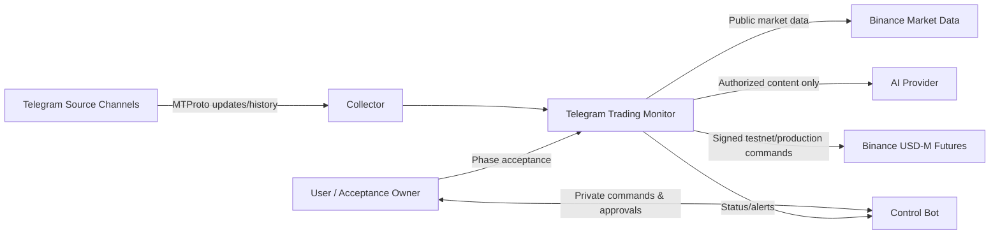
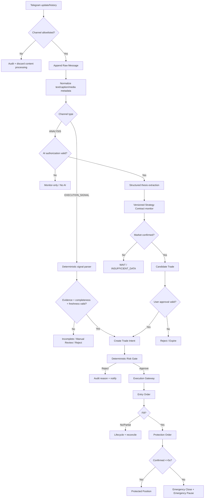
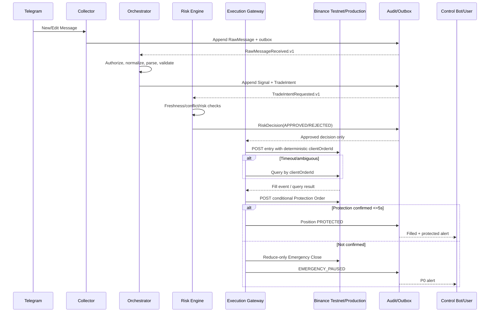
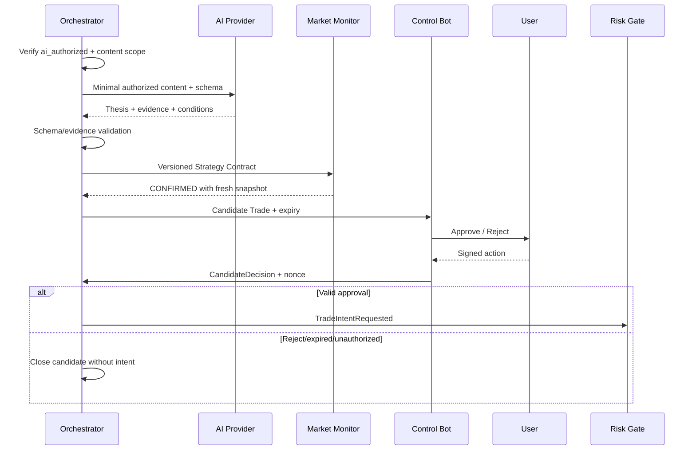
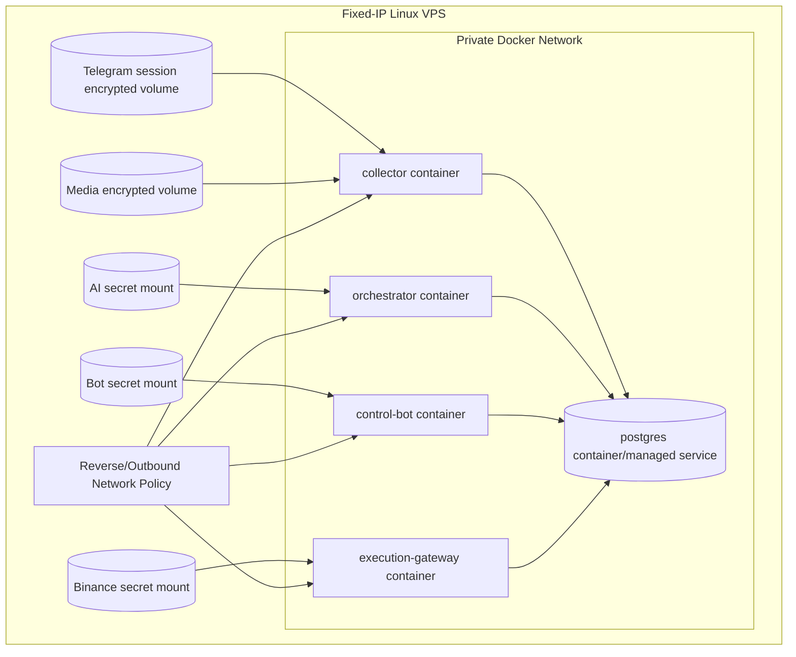

# Architecture and Data Flow

- **Version:** v0.1
- **Date:** 2026-09-03
- **Status:** Accepted with Gate 0 user acceptance on 2026-09-03
- **Implementation Evidence:** None; Phase 0 architecture only

## 1. Architecture Principles

1. Business safety precedes latency: unknown, stale, ambiguous or unhealthy states fail closed.
2. Credentials are separated by process and mounted only when the corresponding Phase permits them.
3. LLM output is untrusted input; deterministic code retains all trade authority.
4. Every external side effect has an idempotency identity and immutable audit evidence.
5. PostgreSQL transactional outbox is the only MVP queue; avoid Redis/RabbitMQ/Kubernetes until evidence requires them.
6. Deployment starts `PAUSED`; readiness must be positively established after restart/reconciliation.

## 2. System Context

### Trust Boundaries

| Boundary | Sensitive Assets | Allowed Flow | Prohibited Flow |
|---|---|---|---|
| Telegram Collector | User session、API hash、private content | Raw Message event | Binance key、AI key、order command |
| Orchestrator | Authorized content、AI key | Normalized content、thesis、signal/intents | Direct Binance credential/API call |
| Control Bot | Bot Token、allowlisted user ID | Commands、approval、alerts | Telegram User session、Binance Secret |
| Execution Gateway | Binance key/secret、account/order state | Approved Risk Decision、order events | Raw channel content、LLM prompt/output |
| Database | Domain/audit records | Versioned records/outbox | Runtime secrets、2FA/login codes |

## 3. Runtime Components

| Component | Responsibility | Inputs | Outputs | Credential | Introduced Phase |
|---|---|---|---|---|---|
| `collector` | Telegram auth、updates、history/gap recovery、media | Telegram MTProto | `RawMessageReceived.v1` | Telegram User session | 2 |
| `orchestrator` | Normalize、authorize、parse、thesis、signal lifecycle | Raw events、market snapshot | Signals、candidates、Trade Intents | AI key only when authorized | 3–5 |
| `control-bot` | Private UI、commands、approval、alerts | User Bot API updates、domain events | Control commands、candidate decisions | Bot Token | 4 |
| `risk-engine` | Deterministic validation and sizing | Trade Intent、account/market/config snapshots | Risk Decision | None | 6 |
| `execution-gateway` | Binance adapter、orders、protection、reconciliation | Approved Risk Decision | Order lifecycle、account snapshots | Binance key/secret | 6 |
| `postgres` | Domain state、audit、transactional outbox、checkpoints | Service transactions | Queries/outbox records | DB credential per service | 1 |
| `monitoring` | Metrics、health、alerts | Service and business metrics | Alerts/status | Alert target config | 1+ |

`risk-engine` may initially run in the execution container but remains a separate module and authority boundary. It must not import AI or Telegram adapters.

## 4. Application Data Flow

## 5. Key Sequences

### 5.1 EXECUTION_SIGNAL to Protected Position

### 5.2 ANALYSIS Approval Boundary

## 6. Phase Capability Matrix

| Capability | 0 | 1 | 2 | 3 | 4 | 5 | 6 | 7 | 8 |
|---|---:|---:|---:|---:|---:|---:|---:|---:|---:|
| Specifications only | ✓ |  |  |  |  |  |  |  |  |
| Offline database/simulator |  | ✓ | ✓ | ✓ | ✓ | ✓ | ✓ | ✓ | ✓ |
| Telegram read-only |  |  | ✓ | ✓ | ✓ | ✓ | ✓ | ✓ | ✓ |
| Normalization/OCR |  |  |  | ✓ | ✓ | ✓ | ✓ | ✓ | ✓ |
| Signal lifecycle/Control Bot |  |  |  |  | ✓ | ✓ | ✓ | ✓ | ✓ |
| Authorized AI/public market data |  |  |  |  |  | ✓ | ✓ | ✓ | ✓ |
| Binance Testnet signed trade |  |  |  |  |  |  | ✓ | ✓ |  |
| End-to-end Testnet |  |  |  |  |  |  |  | ✓ |  |
| Production signed trade |  |  |  |  |  |  |  |  | ✓ |

Startup must validate the accepted Gate state and environment capability. A broader configured capability than the accepted Phase is a startup error.

## 7. Deployment View

### Network Allowlist Direction

- Collector: Telegram endpoints required by MTProto.
- Orchestrator: approved AI provider endpoint and Binance public data only when Phase permits.
- Control Bot: Telegram Bot API.
- Execution Gateway Testnet: `demo-fapi.binance.com` and `demo-fstream.binance.com` only.
- Execution Gateway Production: production Binance Futures hosts only; Testnet/Production configuration is mutually exclusive.

## 8. Transaction and Idempotency Design

1. Domain state change、Audit Event and Outbox Event are committed in one PostgreSQL transaction.
2. Consumer records `event_id` before/with applying effects; duplicate event delivery is a no-op with audit count.
3. `TradeIntent.idempotency_key` derives from stable source/candidate identity and intent revision.
4. Entry `newClientOrderId` derives from Trade Intent identity and stays within Binance format/length limits.
5. Network timeout never implies failure or retry permission; query by identity first.
6. Reconciliation can advance local state from verified external truth but cannot silently create a missing business decision.

## 9. Readiness Model

Execution readiness is true only when all are true:

- Current Phase capability is accepted.
- System Control State is `ACTIVE`.
- Database/audit/outbox are healthy.
- Host clock skew <= 500 ms.
- Market stream is live and within freshness limits.
- Account/order/position reconciliation is complete.
- No unresolved Telegram/source gap affects the Trade Intent.
- Channel Policy and all required authorizations are valid.
- Risk snapshot is fresh and all hard limits pass.
- Environment/credential host allowlist matches Testnet or Production exactly.

Any false/unknown condition yields `NOT_READY` and no new order.

## 10. Failure Boundaries

| Failure | Blast Radius | Containment |
|---|---|---|
| Collector compromise | Telegram session/source content | No Binance/AI/Bot secret; revoke session |
| AI prompt/output compromise | Authorized content/thesis path | No execution tool/key; validators + manual ANALYSIS approval |
| Control Bot token compromise | Command attempts | Numeric allowlist + nonce + risk gate; rotate token |
| Execution Gateway compromise | Testnet/production subaccount | Low balance, no withdrawal, fixed IP, isolated key, pause/kill switch |
| Database compromise | Domain/audit content | Encryption/access control; secrets never stored; credential rotation if metadata exposure matters |
| Provider outage | Corresponding path only | Fail closed; monitoring/close operations preserved when safe |

## 11. Architecture Decisions

- [ADR-0001 Sequential Stage Gates](../adr/0001-sequential-stage-gates.md)
- [ADR-0002 Separate Credential Boundaries](../adr/0002-separate-credential-boundaries.md)
- [ADR-0003 Deterministic Trade Authority](../adr/0003-deterministic-trade-authority.md)

## 12. Architecture Validation Required Later

| Validation | Blocking Gate |
|---|---|
| PostgreSQL outbox replay and crash consistency | Gate 1 |
| Telegram update/gap semantics through Telethon adapter | Gate 2 |
| Per-channel sample throughput/storage actuals | Gate 3 |
| Control Bot nonce/auth boundary | Gate 4 |
| AI structured output and data-use contract | Gate 5 |
| Binance current endpoints, filters, order/protection semantics | Gate 6 |
| Full restart/restore/reconcile and 24h soak | Gate 7 |
| VPS network/secret isolation and canary blast radius | Gate 8 |
