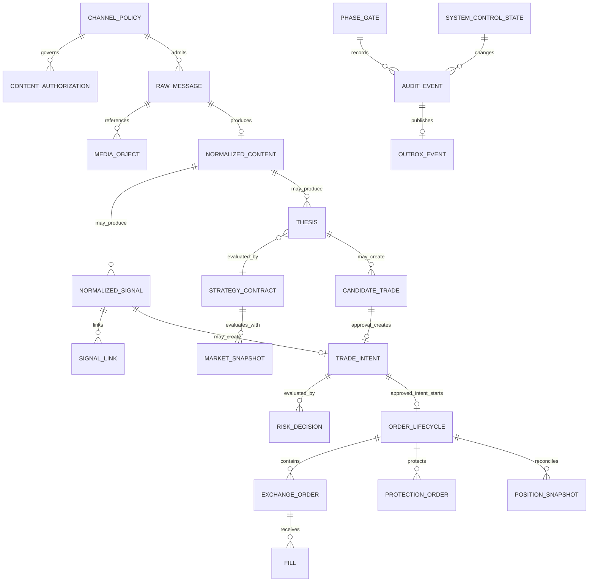
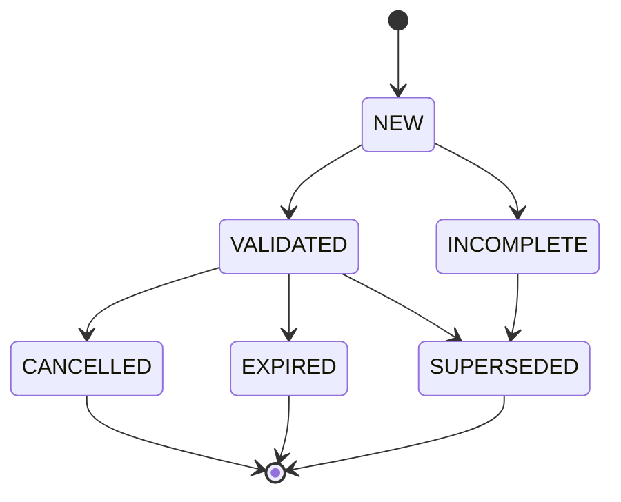
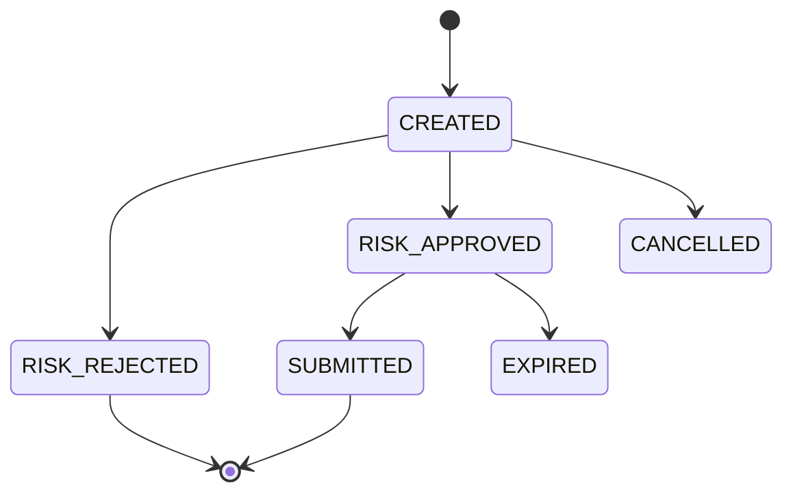
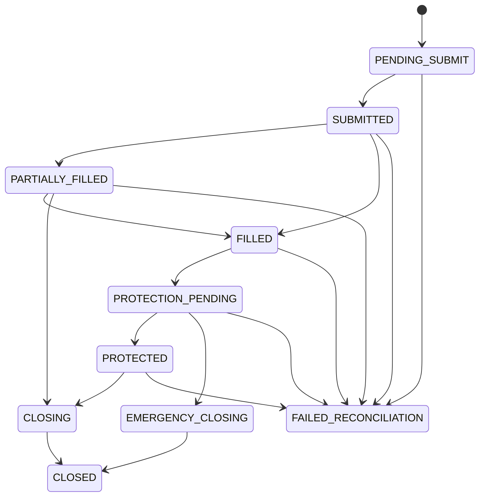

# Logical Data Model

- **Version:** v0.1
- **Status:** Logical design only; no SQL DDL or migration exists in Phase 0
- **Rule:** Names and fields may be refined before Gate 1, but lifecycle invariants require a specification revision and acceptance record.

## 1. Entity Overview

| Entity | Purpose | Key Fields | Lifecycle / Retention |
|---|---|---|---|
| `phase_gate` | Store Phase/Gate governance | `phase_id`, `verdict`, `evidence_digest`, `accepted_by`, `accepted_at` | Append revisions; permanent project evidence |
| `channel_policy` | Versioned source usage rules | `policy_id`, `channel_id`, `channel_type`, `status`, limits, retention | Versioned; retired policies retained |
| `content_authorization` | Evidence/status for access, automation, AI | `authorization_id`, scope, status, evidence_ref, validity | Append changes; revoke immediately effective |
| `raw_message` | Immutable Telegram source event/version | `raw_message_id`, channel/message/version, source/receive times, text/caption | Raw content default 7 days; identity/audit longer per policy |
| `media_object` | Content-addressed media metadata | `media_id`, `sha256`, mime, size, local_ref, scan status | Per Channel Policy; secure deletion |
| `normalized_content` | Deterministic normalized text/evidence | `content_id`, `raw_message_id`, schema/config version, normalized text | Follows source retention unless necessary audit subset |
| `normalized_signal` | Parsed EXECUTION_SIGNAL structure | `signal_id`, revision, symbol, side, entry, SL/TP, status, evidence | Audit retention TBD; no silent overwrite |
| `signal_link` | Link follow-up to lifecycle | child/parent IDs, method, confidence, resolution | Permanent with signal audit |
| `thesis` | Structured ANALYSIS proposition | `thesis_id`, channel/message, status, evidence, conditions | Per authorization/retention |
| `strategy_contract` | Versioned market confirmation rules | `contract_id`, version, channel, rules digest, effective time | Never mutate published version |
| `market_snapshot` | Time-bound market evidence | `snapshot_id`, symbol, source/event/receive times, payload hash, freshness | Retain enough for decision replay; TBD before Gate 5 |
| `candidate_trade` | Human approval object for ANALYSIS | `candidate_id`, thesis, expiry, status, decision actor/time | Audit retention |
| `trade_intent` | Pre-order business intent | `intent_id`, origin, revision, idempotency key, status | Permanent trade audit |
| `risk_decision` | Deterministic approval/rejection | `decision_id`, intent, reasons, snapshots/config versions | Immutable, permanent trade audit |
| `order_lifecycle` | Aggregate exchange execution state | `lifecycle_id`, intent, state, correlation IDs | Permanent trade audit |
| `exchange_order` | Entry/close order identity/status | local/exchange IDs, client ID, type, qty/price/status | Reconciled, append status events |
| `protection_order` | Conditional protection state | algo IDs, stop, state, confirmation deadline | Tied to lifecycle |
| `fill` | Immutable exchange fill | exchange trade ID, qty, price, fee, time | Permanent trade audit |
| `position_snapshot` | Verified position/account state | symbol, amount, entry/mark, unrealized, margin, times | Time series; retention TBD |
| `system_control_state` | Active/pause/emergency state | revision, state, reason, actor, time | Append revisions |
| `audit_event` | Immutable cross-domain evidence | event ID, aggregate, actor, action, reason, hashes, times | Append-only; retention TBD/legal |
| `outbox_event` | Transactional delivery record | event ID/type/version, payload, status, attempts | Delete/archive only after audit policy |
| `consumer_checkpoint` | Exactly-once effect assistance | consumer, event/source position, updated time | Current + history sufficient for recovery |

## 2. ER Diagram

## 3. Logical Field Definitions

### 3.1 `channel_policy`

| Field | Type | Required | Rule |
|---|---|---:|---|
| `policy_id` | UUID | Yes | Immutable version identity |
| `channel_id` | int64/string canonical | Yes | Telegram peer identity; not title |
| `display_name` | string | Yes | Non-authoritative human label |
| `channel_type` | enum | Yes | `ANALYSIS` or `EXECUTION_SIGNAL` |
| `status` | enum | Yes | `DRAFT/MONITOR_ONLY/ENABLED/PAUSED/RETIRED` |
| `symbol_allowlist` | string[] | Yes | Empty means no symbol is permitted |
| `content_types` | enum[] | Yes | `TEXT/CAPTION/IMAGE` in MVP |
| `max_signal_age_sec` | integer | Yes | Default/global max 60 |
| `max_receive_lag_sec` | integer | Yes | Default/global max 10 |
| `max_entry_deviation_bps` | integer | Yes | Default/global max 50 |
| `raw_retention_days` | integer | Yes | Default 7; may be shorter |
| `effective_from/to` | timestamp | Yes/No | No overlapping active versions |
| `config_digest` | sha256 | Yes | Canonical policy hash |

### 3.2 `content_authorization`

| Field | Type | Required | Rule |
|---|---|---:|---|
| `authorization_id` | UUID | Yes | Immutable record |
| `channel_id` | canonical ID | Yes | Scope cannot be global by implication |
| `scope` | enum | Yes | `ACCESS/AUTOMATION/AI_PROCESSING/MEDIA_STORAGE` |
| `status` | enum | Yes | `UNKNOWN/PENDING/GRANTED/REVOKED/EXPIRED` |
| `evidence_ref` | string | Conditional | Required for `GRANTED`; must not embed a secret |
| `granted_by` | string/role | Conditional | Source of permission |
| `valid_from/to` | timestamp | Conditional | Revocation is immediately effective |
| `reviewed_by/at` | role/timestamp | Yes | Human accountability |

### 3.3 `raw_message`

| Field | Type | Required | Rule |
|---|---|---:|---|
| `raw_message_id` | UUID | Yes | Internal immutable ID |
| `channel_id` | canonical ID | Yes | FK to admitted policy context |
| `telegram_message_id` | int64 | Yes | Source identity |
| `edit_version` | integer | Yes | Starts 0; unique with channel/message |
| `source_time` | timestamp UTC | Yes | Telegram event time |
| `received_time` | timestamp UTC | Yes | Local receive time |
| `text/caption` | encrypted text | No | Exact source content within retention |
| `reply_to_message_id` | int64 | No | Source reference |
| `forward_metadata` | structured metadata | No | Minimized; no unnecessary personal data |
| `payload_hash` | sha256 | Yes | Canonical payload digest |
| `ingestion_mode` | enum | Yes | `UPDATE/HISTORY/GAP_RECOVERY` |
| `retention_expires_at` | timestamp | Yes | Deletion eligibility |

Unique constraint: `(channel_id, telegram_message_id, edit_version)`.

### 3.4 `normalized_signal`

| Field | Type | Required | Rule |
|---|---|---:|---|
| `signal_id` | UUID | Yes | Stable aggregate ID |
| `revision` | integer | Yes | Monotonic |
| `raw_message_id` | UUID | Yes | Evidence source |
| `status` | enum | Yes | `NEW/INCOMPLETE/VALIDATED/CANCELLED/EXPIRED/SUPERSEDED` |
| `symbol` | string | Conditional | Required for `VALIDATED` |
| `side` | enum | Conditional | `LONG/SHORT`; required for `VALIDATED` |
| `entry_type` | enum | Conditional | `MARKET/LIMIT/RANGE`; missing means market only when policy allows |
| `entry_values` | decimal[] | No | Never floating binary |
| `stop_value` | decimal | No | Authored stop; validated side relation |
| `stop_origin` | enum | Yes | `AUTHOR/DEFAULT_ROE_30/NONE` |
| `take_profits` | structured decimals | No | No synthesized TP |
| `evidence_spans` | structured offsets/quotes hash | Yes | Every decisive field needs evidence |
| `parser_version` | string | Yes | Reproducibility |
| `expires_at` | timestamp | Yes | Hard expiry |

### 3.5 `trade_intent` and `risk_decision`

| Entity.Field | Type | Rule |
|---|---|---|
| `trade_intent.intent_id` | UUID | Immutable |
| `trade_intent.origin_type/id/revision` | enum/UUID/int | Exactly one Normalized Signal or approved Candidate Trade |
| `trade_intent.idempotency_key` | string | Unique across environment |
| `trade_intent.symbol/side/entry/stop` | structured decimals | Normalized, not yet exchange-rounded |
| `trade_intent.status` | enum | State transition constrained |
| `risk_decision.decision_id` | UUID | Immutable result |
| `risk_decision.intent_id/revision` | FK/int | One current decision per intent revision |
| `risk_decision.verdict` | enum | `APPROVED/REJECTED` only |
| `risk_decision.reason_codes` | string[] | Non-empty for reject |
| `risk_decision.quantity/stop_price` | decimal | Present only if approved |
| `risk_decision.account/market/config_snapshot_id` | FK | All required for replay |
| `risk_decision.expires_at` | timestamp | Approved decision cannot be used when stale |

### 3.6 `order_lifecycle`

| Field | Type | Rule |
|---|---|---|
| `lifecycle_id` | UUID | One per approved intent |
| `environment` | enum | `TESTNET/PRODUCTION`; immutable |
| `entry_client_order_id` | string | Globally unique within environment |
| `state` | enum | Constrained transitions only |
| `protection_deadline` | timestamp | Set after confirmed nonzero fill |
| `correlation_id` | UUID | Propagated to every order/audit event |
| `reconciled_at` | timestamp | Null means execution not ready after restart |

## 4. State Transition Rules

### Signal

### Trade Intent

### Order Lifecycle

`FAILED_RECONCILIATION` blocks new orders until external truth is resolved; it does not imply the exchange order failed.

## 5. Data Invariants

1. No application update/delete on `audit_event`; corrections are new events.
2. No `ENABLED` Channel Policy without required authorization scopes and symbol allowlist.
3. No `VALIDATED` signal without source evidence for symbol and side.
4. No Candidate Trade approval without allowlisted actor, nonce, unexpired revision and current candidate state.
5. No `RiskDecision.APPROVED` without fresh market/account/config snapshots.
6. No order submit from an expired/previous intent or risk revision.
7. At most one active entry client order identity per Trade Intent revision.
8. Any nonzero filled quantity starts the protection deadline, including partial fill.
9. A nonzero position is `PROTECTED` only after verified external conditional order state.
10. Environment IDs, credentials and external order identities cannot cross Testnet/Production namespaces.

## 6. Retention and Deletion

| Data Class | Default | Deletion Behavior | TBD |
|---|---|---|---|
| Raw text/caption/media | 7 days | Secure deletion after expiry unless active incident/legal hold | Per-channel authorization may require shorter |
| Normalized content/thesis evidence | Minimum necessary | Remove direct content where possible; preserve hash/decision metadata | Final period before Gate 5 |
| Trade/risk/order/fill/audit | Retain for operational/accounting need | Append-only archive; period TBD | Legal/financial review before Gate 8 |
| Secrets | Never in database | Managed external secret mount/session volume | Provider/VPS selection |
| Test fixtures | Synthetic or explicitly authorized | Version controlled only if non-sensitive | User confirms samples |

## 7. Migration Concerns

- Phase 1 must establish schema migration versioning and reversible empty-schema migration.
- Destructive migrations require backup/restore evidence and separate acceptance.
- Event schema changes are additive where possible; consumers reject unsupported major versions.
- Policy/Strategy Contract changes create new effective versions, never retroactively rewrite historic decisions.
